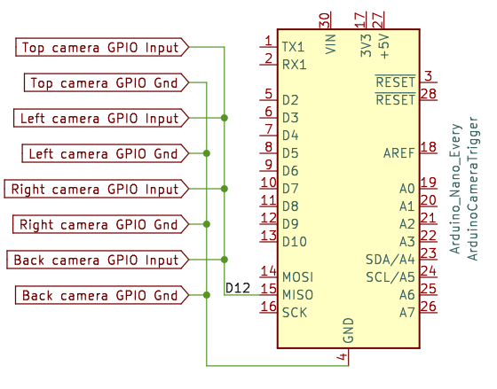
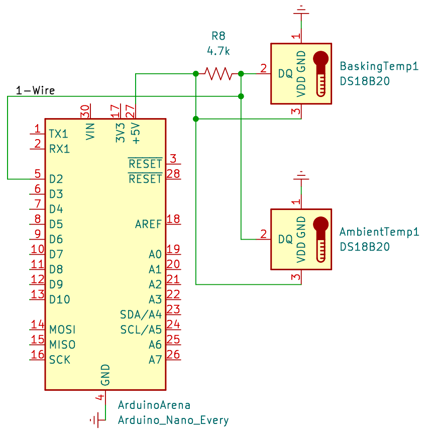
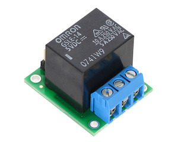
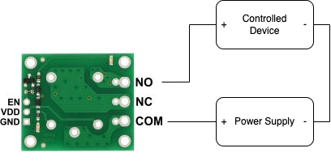

# How to build a ReptiLearn Arena

This document describes how we built our automated arenas for studying various reptiles. We take no responsibility for any damage caused as a result of following this guide.

## Arena

First build the Arena container.

1. Obtain and cut the wall sheets and frame as necessary (explained elsewhere).
2. Stick anti-reflection wallpapers on the walls. We used black self-adhesive wallpaper rolls suitable to be used as a chalkboard. 
3. Build a box. We used aluminum profiles for the frame and Alucobond sheets for the walls and floor. The floor size was 100x70 cm, and the walls height was 45cm. 
4. To support the top-view camera and other devices (e.g. heat lamps), add another profile one meter above the floor, spanning along the long axis of the box. The profile can be supported by two more profiles connected to the short sides of the box.
5. Connect adjustable camera arms to the top frame of the box, and optionally an additional one on the profile you added on the previous step. We used [this product](https://www.noga.com/Products/modu/Modular%20Holders/LC6100/LC_Arms_-_LC6100). To connect the cameras we used a 3d-printed camera holder that connects the arms to the cameras with screws (STL file TBD).

## Electronics

`General soldering advice: Prevent short-circuits! Use heat shrink tubes for insulation and don't leave any uncovered wires.`

* Decide where and how to place your electronics. This determines the length of the cables you will need to make. Some box or a plate to hold the components could be useful.
* Electronic devices are controlled using Arduino boards. We use “Arduino Nano Every” boards. They are quite inexpensive, have a large enough memory to fit our program, and can be easily mounted on a prototyping breadboard. Other Arduino boards could be used as well but might have a different pinout and/or memory size. Some Arduino boards use 3V instead of 5V. _We didn’t test 3V boards, and some of the components described below might not work in 3V._

### Part 1: Synchronized Camera Trigger (Arduino 1 / 2)

When recording from multiple cameras it’s often desirable that all cameras expose their sensors and take images at the same time. There are several schemes for doing that. We use a single source to trigger all the cameras. One Arduino board is programmed (see elsewhere) to send TTL pulses on one of its output pins. This pin is connected in parallel to the GPIO input of each camera. A two strand cable should go from the Arduino output pin and ground pin (gnd) to the camera GPIO input and ground. Consult the camera manual for the specifics of using its GPIO inputs. In the case of **FLIR cameras** we use their GPIO cable that connects to the camera on one side and has colored wires on the other. ReptiLearn sets the cameras to use Line3 by default (but this can be changed). For example, for a Firefly camera, this page: [Input/Output Control FFY-U3-16S2](http://softwareservices.flir.com/FFY-U3-16S2/latest/40-Installation/InputOutputControl.htm) will tell you to connect the Arduino output to the green wire and the ground pin to the brown wire.



Connection diagram showing how to connect four cameras to an Arduino Nano Every board. To find the location of each I/O connection on the board check this page (for this specific board): [Nano Every | Arduino Documentation](https://docs.arduino.cc/hardware/nano-every). Look for the pinout.

```
Note: Don't use the camera trigger Arduino board for anything other than sending triggers. Communication with other components might cause the trigger timing to vary.
```

### Part 2: The Feeder (Arduino 2 / 2)

To reward the animals we used a Fish Feeder (EVNICE EV200GW). This feeder normally has a latency of about 15 seconds which might not be acceptable for some tasks. We reduced the latency to about 3 seconds by interfacing directly with the feeder motor. 

The feeder has a 28BYJ-48 stepper motor. We control it by connecting it to a ULN2003 stepper motor driver board that looks like this:


The layout of this specific board is easy to work with as you’ll see. As mentioned, you shouldn’t connect this to the camera trigger Arduino. Use a second one and follow these steps:

1. Unscrew and remove the bottom plastic cover of the feeder
2. Remove the plastic cover that hides the motor
3. Disconnect the motor cable from the feeder board and connect it to the white header on the ULN2003 board.
4. The feeder has a DC power socket. This socket is connected to the board with a small cable with 2 wires. Disconnect it from the board and connect it to the power inputs on the ULN2003 board (usually marked + -, black header on the right side in the picture above). The red power wire goes to the +, the black goes to the minus (ground). To make this connection we use male to female dupont jumper wires. The male pins can be inserted into the correct pins of the 3-pin socket, and the female pins connect to the ULN2003 board. Alternatively you can cut off the 3-pin socket and solder dupont female pins directly to the black and red wires. Technically the ground should also be connected to the Arduino GND pin but we found this to be usually unnecessary. This is the first thing to check if something doesn’t work, though.
5. Connect the four inputs marked IN1-IN4 to digital pins on the Arduino board (e.g. D9, D10, D11, D12).
6. Close and screw the bottom cover back, making sure all the wires can get to where they need to be. There are 4 LEDs on the board that light up in sequence during feeding, you might want to hide or show these depending on your needs.
7. Use the mounting mechanism provided together with the feeder to fix everything to the top frame of the arena.
8. Connect a 5V 1A DC power supply to the DC power socket on the feeder (a power supply with a bit less current may also work).

Our setup is very similar to the one described [here](https://lastminuteengineers.com/28byj48-stepper-motor-arduino-tutorial/)

### Part 3: Temperature sensors

We use two digital DS18B20 temperature sensors for measuring temperature conditions in the arena. These can come in a metal or plastic packaging and have 3 wires. They use the [1-Wire](https://en.wikipedia.org/wiki/1-Wire) protocol to communicate with the Arduino, enabling up to 128 sensors to be connected in parallel using a single Arduino digital pin.

See [here](https://lastminuteengineers.com/multiple-ds18b20-arduino-tutorial/) for more info.

* The sensor has 3 IO pins: VDD (5v), GND (ground), and DQ. First figure out which wire is which.
* Then, for each sensor, use a cable with 3 or more wires, and connect VDD to the +5V pin of the Arduino board, GND to the GND pin, and DQ to a digital I/O pin. 
* Additionally, VDD and DQ must be connected with a 4.7kOhm pull-up resistor. The resistor can be shared between all sensors (each DQ to one side of the resistor and each VDD to the other).



### Part 4: Controlling things with relays

A relay is a mechanical device that can close or open a circuit based on a control voltage. Any device that requires a high current, which you want to switch on and off requires a relay. We used relays for controlling an LED strip that lights the arena, as well as heat lamps.

We used [this](https://www.pololu.com/product/2480/) board which includes an Omron G5LE-14-DC5 SPDT relay.






The relay board has 6 I/O connections. EN, VDD, and GND connect to the Arduino board (male pins in front of the image above), and NO, NC, and COM are the controlled connections (blue socket with screws in the back of the image above). Connect VDD to the Arduino +5V pin, and GND to the Arduino GND (ground) pin. EN, the signal pin, should be connected to one of the Arduino’s digital output pins. 

The relay has two modes of operation depending on which connections are used for connecting the controlled device. The NO (Normally open) pin is connected to the COM (common) pin only when the EN pin is high (i.e., when there’s a 5v voltage between EN and GND). The NC (Normally closed) pin is connected to the COM pin only when the EN pin is low (no voltage across EN and GND). We always use the NO pin so that current will only arrive to the device when the Arduino is running and its digital pin is high.

In practical terms one of the wires going from the power supply to the controlled device (positive in the diagram above) should be cut somewhere in the middle, and then the half that goes from the power supply should be connected to COM, and the other half to NO (see diagram above).

We connected both a LED strip and heat lamps using this method. The relay can be connected to either the AC or DC part of a DC power supply. You may want to connect multiple devices to the same power supply in parallel (e.g. multiple heat lamps to the same power supply). In this case you would want to connect the relay to each cable that connects the power supply to one of the devices in order to be able to control each device individually.

### LED Strip

We used a 12V cold-white LED strip to light the arena. The LED strip is taped to the top frame and covers the four top edges of the arena. This results in a mostly uniform light level across the arena floor, and helps to minimize shadows. The total length is then around 3.4 meters, which required a 12V 5A DC power supply for the strips we used (consult your LED strip manufacturer for the maximum current it might draw, and adjust the power supply as necessary).

### Heat Lamps

We had success using these [IR halogen heat lamps](https://he.aliexpress.com/item/4001212438174.html?spm=a2g0o.productlist.0.0.3b561783JmP4VQ&algo_pvid=f1c2b25b-032a-41a0-b267-9318c73811c5&algo_exp_id=f1c2b25b-032a-41a0-b267-9318c73811c5-25&pdp_ext_f=%7B%22sku_id%22%3A%2210000015319775871%22%7D&gatewayAdapt=glo2isr).

They are 24V 50W DC lamps which means that they will need a current of at least 50/24=~2A per lamp, however halogen lamps can have a much lower resistance when they are cold and therefore can take much more current initially. It is recommended to use a power supply with at least double the current (e.g. 4A per lamp or more). We used a 24V 12A DC power supply for two lamps.

## Touch screen

A touch screen can be connected to the arena computer in the usual way. ReptiLearn has support for switching the screen on or off (linux only, currently). 

We used a Dell monitor with good results for behavioral experiments. For using a touch screen while making electrophysiological recordings, we used [this monitor](https://www.connection.com/product/elo-touch-solutions-accutouch-1790l-17-lcd-open-frame-touchscreen-display-hdmi-vga-displayport-usb/e326347/34520493?cac=Result) to reduce electromagnetic noise.

We mount the monitor using screws to one of the shorter (0.7m) sides of the arena. A Kappa board or some other strong board can be used to hide the monitor cables and prevent the animal from using the monitor to escape. Cut it to fit into the arena, and make a square hole that fits the monitor (that is, make a frame for the monitor).


## Finishing touches

Once everything is built, follow these final steps:

* Mount the cameras using the camera holders
* Connect Cameras and Arduino boards to the computer using USB cables. Make sure the camera cables support a fast enough USB mode to reach the frame rates you want to record in. We had success with the [FLIR USB cables](https://www.flir.eu/products/usb-3.1-locking-cable/) that are sold on their website.
* Connect GPIO cables to cameras
* Place Arduino boards and other electronic components in their final location (e.g. a box or plate)
* Hide cables and make it look tidy and neat.
* Connect power supplies
* [Setup the ReptiLearn software](getting_started.md)
* Have fun
