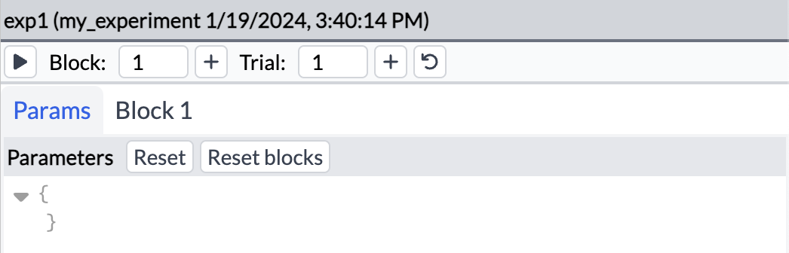

# Programming experiments <!-- omit in toc -->

This document should help you get started with creating new experiments for ReptiLearn.

## Table of contents <!-- omit in toc -->

- [ReptiLearn sessions and experiments](#reptilearn-sessions-and-experiments)
  - [Creating a new experiment module](#creating-a-new-experiment-module)
  - [Running an experiment session](#running-an-experiment-session)
  - [Reloading the experiment code](#reloading-the-experiment-code)
- [The Experiment class](#the-experiment-class)
  - [Experiment session lifecycle](#experiment-session-lifecycle)
  - [Experiment parameters](#experiment-parameters)
    - [Built-in parameters](#built-in-parameters)
- [State store](#state-store)
  - [Accessing the state store](#accessing-the-state-store)
  - [State change notifications](#state-change-notifications)
  - [Store internals (advanced)](#store-internals-advanced)
- [Controlling the experiment flow](#controlling-the-experiment-flow)
- [Scheduling](#scheduling)
  - [once()](#once)
  - [repeat()](#repeat)
  - [timeofday() and on\_datetime()](#timeofday-and-on_datetime)
  - [sequence()](#sequence)
  - [Scheduling with asyncio](#scheduling-with-asyncio)
- [Actions](#actions)
- [Video system](#video-system)
  - [Adding an ImageSource](#adding-an-imagesource)
  - [Video recording](#video-recording)
  - [Image capture](#image-capture)
  - [Adding an ImageObserver](#adding-an-imageobserver)
  - [Interacting with an ImageObserver](#interacting-with-an-imageobserver)
  - [Creating a new ImageObserver class](#creating-a-new-imageobserver-class)
  - [Creating a new ImageSource class](#creating-a-new-imagesource-class)
  - [Reloading sources and observers](#reloading-sources-and-observers)
- [Arena controller](#arena-controller)
  - [Reading arduino state](#reading-arduino-state)
  - [Creating new interfaces](#creating-new-interfaces)
- [Data logging](#data-logging)
  - [Event logger](#event-logger)
  - [ImageObserver loggers](#imageobserver-loggers)
  - [Custom data loggers](#custom-data-loggers)
- [Graphical interfaces with Canvas](#graphical-interfaces-with-canvas)


## ReptiLearn sessions and experiments

### Creating a new experiment module

When a new ReptiLearn session is created the user can choose an experiment class that will run during the session. The class determines the behavior of the experiment and includes functions that run in response to various events. To add a new experiment class create a new python module inside [`/system/experiments`](../system/experiments/) (for example `my_experiment.py`). The experiment file must include a single subclass of the [Experiment](../system/experiment.py#802) class. Here's an example for an experiment that does nothing:

```python
import experiment as exp

class MyExperiment(exp.Experiment):
    pass
```

### Running an experiment session

Once your experiment module is stored in the experiments directory you can create a new session using it.

- Make sure the system is running and open the Web UI
- Open the session menu and click on "Start new session..."
- Find your new experiment in the list
- Create session by clicking the Ok button

<p align="center">
    
</p>

At this point a new session and session directory will be created. You can find the location of the new directory in the system log at the bottom of the window. 

<p align="center">
    
</p>

The experiment panel should also appear
on the top right corner of the UI allowing to customize and control the experiment.

To start the experiment click on the play button at the top bar of the experiment panel. The top bar also includes controls for moving to the next trial or block and a button to reset the experiment and go back to the first trial and block.

<p align="center">
    
</p>


### Reloading the experiment code

Once you make changes to your experiment code you can update the session by opening the session menu and clicking on "Reload session". This will reopen the session and run the new code without needing to restart the system.

## The Experiment class

The Experiment class we created above provides an interface for the system to run your code. This includes methods that are called on specific events, default parameter values, and actions. It also provides access to the system logger using `self.log` 

### Experiment session lifecycle

The experiment can react to a number of events that occur during a running session:

1. `setup` - the session was opened
2. `run` - the experiment started running (for example when a Web UI user clicks the run button)
3. `run_block` - a new block started
4. `run_trial` - a new trial started
5. `end_trial` - a trial ended
6. `end_block` - a block ended
7. `end` - the experiment ended (triggered automatically or by clicking the stop button in the web UI)
8. `release` - the session is closed

Each of these events can trigger code in your experiment class by overriding a specific instance method:

```python
import experiment as exp

class MyExperiment(exp.Experiment):
    def run(self):
        self.log.info("My experiment is running!")

    def end(self):
        self.log.info("My experiment has ended!")
```

After updating your experiment code and reloading the session, you should see log messages appearing in the web UI when running or stopping the experiment. Similarly, you can add functions for each of the events listed above.

### Experiment parameters

The Experiment class can define parameters which can be modified from the web UI. Parameter values can be accessed by the experiment code and affect its behavior. The experiment should define a default value for each parameter. These values will appear in the experiment panel when a session is created allowing users to easily customize them. Default parameter values are defined using the `default_params` class field. For example, to define a "color" parameter with a default value "blue" add the following code:

```python
import experiment as exp

class MyExperiment(exp.Experiment):
    default_params = {
        "color": "blue",
    }

    def run(self):
        self.log.info("My experiment is running!")
    ...
```

Experiment blocks can be configured to override some or all parameter values. Default block parameters can be defined in the experiment class in a similar way to experiment parameters. For example:

```python
import experiment as exp

class MyExperiment(exp.Experiment):
    default_params = {
        "color": "blue",
    }

    default_blocks = [
        {"color": "red"},
        {"color": "green"},
        {}
    ]

    def run(self):
        self.log.info("My experiment is running!")
    ...
```

After reloading the session and clicking on "Reset blocks" you should see 3 block tabs in the experiment panel, each with a different value for the color parameter. Since we did not set a value for the parameter on the 3rd block, its value will be the same as the value defined in the experiment parameters. This will be the value that was set in the Params tab, which is defined the default value "blue".

The "Override" menu in each block tab provides a list of all available parameters. Clicking on a parameter will add it to the block parameters dictionary allowing you to easily change its value for this block.

<p align="center">
    
</p>

<p align="center">
    
</p>

To access the current parameter value of the current block you can use the `get_params` function from the experiment module. For example, add the following `run_block` method to your class:

```python
class MyExperiment(exp.Experiment):
    default_params = {
        "color": "blue",
    }

    default_blocks = [
        {"color": "red"},
        {"color": "green"},
        {}
    ]

    def run_block(self):
        color = exp.get_params()["color"]
        self.log.info(f"Starting new block. Color is {color}")
    ...
```

If you run the experiment with default parameters and click on the next block button until the experiment stops you should see the following sequence of log messages:

```
My experiment is running!
Starting new block. Color is red
Starting new block. Color is green
Starting new block. Color is blue
My experiment has ended!
```

#### Built-in parameters

The system provides a number of built-in parameters that can be used to further customize the experiment flow and timing from the web UI. Each begins with a `$` sign:

- $num_trials: Set a number of trials until the block ends automatically.
- $block_duration: Set the duration of a block in seconds.
- $trial_duration: Set the duration of each trial in seconds.
- $inter_trial_interval: Set the duration between the end of a trial and the beginning of the next one.

These parameters can be set in all the ways mentioned above for regular parameters. They also appear in the "Override" menu in each block tab. 

## State store

The state store contains information about the system and the currently running session. It is used to safely share data between different processes (e.g. image sources, image observers, data loggers, and the experiment class). It is also the web UI's main source of information about the state of the system. Whenever a value in the state store changes the new store is immediately reflected in the UI, and can be inspected using the state panel (found below the experiment panel).

<p align="center">
    
</p>

### Accessing the state store

The store can be accessed in experiment code using `exp.state` like so:

```python
import experiment as exp

class MyExperiment(exp.Experiment):
    ...

    def run_trial(self):
        if exp.state["video"]["record"]["is_recording"]:
            self.log.info("Video is being recorded")
        else:
            self.log.info("Video is not being recorded")

    ...
```

The state is a hierarchical structure and may contain nested arrays and dictionaries. To make it easier to access a specific value *path indexing* should be used:

```python
class MyExperiment(exp.Experiment):
    ...

    def run_trial(self):
        if exp.state["video", "record", "is_recording"]:
            self.log.info("Video is being recorded")
        else:
            self.log.info("Video is not being recorded")

    ...
```

The `exp.state` variable used above behaves similarly to a python dictionary but actually it is a [`managed_state.Cursor`](../system/managed_state.py) object. A cursor points to a specific path inside the state structure and can be used to limit access to certain areas of the state or as a shorthand. For example, the `exp.state` cursor points to the root of the state, and `exp.session_state` is a cursor pointing to the "session" state key. This means that `exp.state["session", "is_running"]` is equivalent to `exp.session_state["is_running"]`. 

Since up-to-date store values are always available in the web UI, using the store can also be used for conveying the current state of the experiment to the user. For example, update your `run_trial` method:

```python
    def run_trial(self):
        if exp.state["video", "record", "is_recording"]:
            self.log.info("Video is being recorded")
        else:
            self.log.info("Video is not being recorded")

        exp.session_state["is_even_trial"] =  exp.session_state["cur_trial"] % 2 == 0
```

Reload the session and run the experiment. You should see the `is_even_trial` key appear in the `session` dictionary in the state panel. Switch to the next trial and see how the value changes between `true` and `false` (If you're wondering why the first trial is considered even, this is because "cur_trial" holds the zero-based index of the current trial).

NOTE: It's important to note that the previous example would not work if we change the last line to look like this:

```python
exp.state["session"]["is_even_trial"] = exp.state["session"]["cur_trial"] % 2 == 0  # won't work
```

Here we first get the current value of the state `session` dictionary and then update one of its values, however since `exp.state["session"]` is a python dictionary and not a state `Cursor` this change will not be reflected in the state store. To fix this you should use the following instead:

```python
exp.state["session", "is_event_trial"] = exp.state["session", "cur_trial"] % 2 == 0
```

This version will update the store since the new value is assigned to an index of the `exp.state` object which is indeed a state `Cursor`.

The `Cursor` class includes many additional methods for modifying and accessing the store. See [`managed_state.py`](../system/managed_state.py) for more information.

### State change notifications

In addition to reading and writing to the store, experiments can also be notified when state store values change. For example, add the following methods to your experiment class:

```python
    ...
    
    def setup(self):
        exp.session_state.add_callback("is_even_trial", self.on_is_even_trial_changed)

    def on_is_even_trial_changed(self, old, new):
        self.log.info(f"is_even_trial changed from: {old} to: {new}")

    def release(self):
        exp.session_state.remove_callback("is_even_trial")
    ...
```

After reloading your session the new `setup` function will run and you should see the following text when switching to the 2nd trial:

```is_even_trial changed from: True to: False```

This allows experiment code to respond to various events even when the changes come from other system subprocesses.

### Store internals (advanced)

The state store is implemented by the `managed_state.StateStore` class. This class maintains a [`multiprocessing.managers.SyncManager`](https://docs.python.org/3/library/multiprocessing.html#multiprocessing.managers.SyncManager) server on a separate thread. A `Cursor` object creates a connection to the server from the process that created it, which can be a subprocess of the main ReptiLearn process or even a process running a different python script altogether.

The manager server allows different processes to safely share information. Only one `Cursor` object is allowed to modify the state at any time. On each modification the whole state dictionary is first copied, then the copy is updated to reflect the modification, and finally the old state is overwritten with the modified copy. This prevents data corruption and conflicts between changes coming from different processes. When reading values from the store the whole store is copied before returning the value in order to make sure values don't change while reading them. This currently has performance implications which means the store should be kept relatively small, otherwise accessing it might become too slow. If that becomes a problem, the store can be optimized in the future by using more efficient data structures.

## Controlling the experiment flow

It's often useful to switch to the next block or trial automatically based on some event or condition. The `experiment` module provides the `next_block` and `next_trial` methods for this purpose. The `reset_phase` function can also be used to go back to the first block and trial. For example add the following method to your experiment:

```python
    def end_trial(self):
        if exp.session_state["cur_trial"] >= exp.session_state["cur_block"]:
            exp.next_block()
```

After reloading the session, block 1 will have one trial and each block will have one more trial than the previous.

## Scheduling

The `schedule` module provides several functions for controlling the timing of your experiment.

### once()

The `once` function calls a function after a time interval passes:

```python
import schedule as sc
import experiment as exp


class SchedulingExperiment(exp.Experiment):
    def setup(self):
        self.cancel_next_block = None

    def run_block(self):
        if self.cancel_next_block is not None:
            self.cancel_next_block()

        self.cancel_next_block = sc.once(exp.next_block, interval=5)

```

This experiment will switch to the next block after 5 seconds. Every schedule function returns a function that cancels the schedule. Here, if the block ends before 5 seconds have passed (for example, by manually clicking the next block button) the previous schedule will be canceled and before a new schedule will start. 

### repeat()

The `repeat` function calls a function at a time interval multiple times:

```python
import schedule as sc
import experiment as exp


class SchedulingExperiment(exp.Experiment):
    def setup(self):
        self.cancel_tick = None
        self.cancel_next_block = None

    def run(self):
        self.cancel_tick = sc.repeat(self.tick, interval=2, repeats=True)
    
    def end(self):
        if self.cancel_tick is not None:
            self.cancel_tick()

    def tick(self):
        self.log.info("tick!")

    ...
```

After updating the code the `tick` log message should appear every 2 seconds while the experiment is running. 

### timeofday() and on_datetime()

The `timeofday` function calls a function a specific time. It can run once or repeat every day (or a specific number of days). `on_datetime` will call its function on a specific date and time. For example:

```python
import schedule as sc
import datetime as dt

cancel_fn = sc.timeofday(tick, [7, 0], repeats=True)  # Call tick() every day at 7 a.m.
cancel_fn = sc.on_datetime(tick, dt.datetime.now() + dt.timedelta(days=3))  # Call tick() exactly 3 days from now
```

### sequence()

The `sequence` function takes a sequence of intervals and calls a function according to it. For example:

```python
import schedule

cancel = sc.sequence(tick, range(4), repeats=2)  # Call tick() after 1 seconds, call again after 2 seconds, call again after 3 seconds and so on. repeat the whole process twice.
```

### Scheduling with asyncio

You can also use the [`asyncio`](https://docs.python.org/3/library/asyncio.html) library to control the timing of your experiment. This allows calling async functions from within experiment event methods, which can be useful when dealing with other async code or libraries. See [phases_asyncio.py](../system/experiments/phases_asyncio.py) for a simple example. See the [Canvas section](#graphical-interfaces-with-canvas) for more `asyncio` uses.

## Actions

The experiment panel can provide an Actions menu for manually triggering experiment functions. You can use this menu to remotely control your experiment in addition to the controls we already mentioned. To add an action simply add an item to the actions dictionary:

```python
import experiment as exp


class ActionsExperiment(exp.Experiment):
    def setup(self):
        self.actions["Action 1"] = {"run": lambda: self.log.info("Action 1")}
        self.actions["Action 2"] = {"run": lambda: self.log.info("Action 2")}
        self.actions["Run"] = {"run": exp.run_experiment}
```

When this experiment is loaded an Actions menu should appear in the experiment panel (see image below) with 3 actions. Clicking on the "Run" action will run the experiment.

The Actions menu can also be updated dynamically. To recreate the menu call the `refresh_actions` function from the `experiment` module:

```python
import experiment as exp


class ActionsExperiment(exp.Experiment):
    def setup(self):
        self.update_actions()
        exp.session_state.add_callback("is_running", self.update_actions)

    def update_actions(self, _, new):
        if new:
            self.actions = {
                "Stop": {"run": exp.stop_experiment},
            }
        else:
            self.actions = {
                "Run": {"run": exp.run_experiment},
            }

        exp.refresh_actions()
    
    def release():
        exp.session_state.remove_callback("is_running")
```

This experiment adds an action to run or stop the experiment. The action label is updated according to the `is_running` session state value.

<p align="center">
    
</p>

## Video system

The [`video_system`](../system/video_system.py) module manages the image processing system. This includes controlling video recording, and creating and maintaining ImageObserver and ImageSource objects. The module stores its state under the `video` key of the state store.

### Adding an ImageSource

To run the following examples you need at least one configured ImageSource running. If you don't have one already you can create a source from a video file:

- Open the Video menu and click on "Video settings..."
- Click on the Sources tab
- Click on the add button (plus)
- Select video_source.VideoImageSource in the class menu and enter an id for the source (for example, "video").
- Find the path of a video file on your file system
- Edit the json below by replacing \<height\> and \<width\> with the height and width dimensions of your video file, and `/path/to/your/video/file` with the path of your video file.
- If your using a monochrome video set "is_color" to false.

```json
{
    "class": "image_sources.video_source.VideoImageSource",
    "image_shape": [<height>, <width>],
    "encoding_config": "cpu",
    "video_path": "path/to/your/video/file",
    "repeat": true,
    "is_color": true
}
```

- Replace the default configuration with the JSON above (you can copy the text, select all the elements in the configuration, and paste over them)
- Click on "Apply & restart" to restart the video system.

You should be see the output of your new source in a stream panel in the web UI. To add a stream panel click on the right-most button of the top menu (camera icon with a plus sign). Your new source should appear in the stream source selection menu.

<p align="center">
    
</p>

### Video recording

The `video_system` module provide ways for controlling synchronized recordings from multiple image sources. You can select record sources using the Video menu or by passing a list of source ids to the `start_record` and `stop_record` functions. Recording files are automatically named and stored in the session directory. A recording id can be added to the video file names by setting one in the ui or by using the `set_filename_prefix` function.

```python
import video_system

# start recording from the currently selected record sources
video_system.start_record()

# stop ongoing recording
video_system.stop_record()

# record from a custom list of image sources
video_system.start_record(["src1", "src2"])

# you can also modify the list of selected record sources
video_system.select_source("src1")
video_system.unselect_source("src1")

# set the recording id (same as manually)
video_system.set_filename_prefix("my_recording")
```

Lower-level functions can be used if you need to control video recording separately for each source. For an example see [`async_recording.py`](../system/experiments/async_recording.py).

### Image capture

The `capture_images` function can be used to store the current image source outputs into JPEG files. These can be later found in the session directory:

```python
import video_system

# Capture possibly synchronized images from the currently selected record sources
video_system.capture_images(filename_prefix="my_img")
```
### Adding an ImageObserver

Adding image observers to the system is done in almost the same way as adding sources. For the next examples first create one by following these steps:
- Open the Video menu and click on "Video settings..."
- Click on the Observers tab
- Click on the add button (plus)
- Select `histogram.HistogramObserver` in the class menu and enter `hist` as the observer id and click add.
- You should now see the default parameters of the new histogram observer. To connect the observer to an existing image source, enter its id into the src_id parameter (see image).
- Click "Apply & restart" to restart the video system and load the new observer.

<p align="center">
    
</p>

### Interacting with an ImageObserver

Once the observer is created and loaded, we can run it and access its output:

```python
import experiment as exp
import video_system as vid


class SimpleObserver(exp.Experiment):
    def setup(self):
        # assuming an observer exists with id "hist"
        self.obs = vid.image_observers["hist"]
        self.obs.start_observing()  # start processing image data

    def run(self):
        # register on_observer_update to run every time the output of the observer updates.
        self.remove_listener = self.obs.add_listener(self.on_observer_update, exp.state)

    def end(self):
        # stop listening to observer updates
        self.remove_listener()

    def on_observer_update(self, output, timestamp):
        # run every time the observer updates its output.
        self.log.info(f"{timestamp}: {output[0]}")  # log the first output value for brevity

    def release(self):
        self.obs.stop_observing()  # stop processing image data

```

### Creating a new ImageObserver class

To add a new observer class place a python file containing a subclass of ImageObserver in the [`system/image_observers` directory](../system/image_observers/). See for example [`test_observer.py`](../system/image_observers/test_observer.py). After adding the file you can use it as described [above](#adding-an-imageobserver). The new class should appear in the list of observer classes. 

### Creating a new ImageSource class

To support new image acquisition methods you can also add additional ImageSources. To add a new source class create a python file in the [`system/image_sources directory](../system/image_sources/) containing an ImageSource subclass. See [`noise.py`](../system/image_sources/noise.py) for a simple example. Once added you can load the image source by adding it using the "Video settings" dialog as described [above](#adding-an-imagesource).

### Reloading sources and observers

After making changes to the code of a source or observer you can reload it by clicking on "Restart video" in the Video menu. This will restart the video system according to the latest configuration.


## Arena controller

The [`arena`](../system/arena.py) module provides methods to control Arduino boards and  various electronic components by communicating with the [arena controller](../arena). See [this page](./arena_setup.md) for information about setting up the arena controller.

To run the following examples you should have at least one configured Arduino board with an LED interface as describe [here](arena_setup.md#adding-interfaces).

Use `run_command` to send a command to a specific interface:

```python
import experiment as exp
import arena


class ArenaControl(exp.Experiment):
    def run_trial(self):
        arena.run_command("toggle", "LED")

```
The LED interface type is `line` which accepts the `toggle` command. For a full list of available interfaces and their commands click [here](./arena_interfaces.md).

You can also pass arguments when running a command:

```python
import experiment as exp
import arena


class ArenaControl(exp.Experiment):
    def run(self):
        arena.run_command("periodic", "LED", [1, 200])

    def end(self):    
        arena.run_command("periodic", "LED", [0])

```

Here we pass the arguments 1 and 200 to the `periodic` command to start toggling the LED every 200 milliseconds.

### Reading arduino state

The state of each interface can be found in the state store under the `("arena", "values")` key. Each interface responds to the `get` command by sending its current state back to the arena controller. When the new state arrives the `arena` module updates the state store accordingly. `("arena", "timestamp")` shows the last update time. To request updating arena values you can use the function `arena.request_values`.

By default, the `run_command` function additionally calls `request_values` each time a command is sent. This helps to make sure the state store always reflects the actual state of the Arduino boards, but can be avoided to save precious Arduino computation time. This version of `run_command` might start blinking a bit faster:

```python
...

class ArenaControl(exp.Experiment):
    def run(self):
        arena.run_command("periodic", "LED", [1, 200], False)  # do not request values
    ...
```

### Creating new interfaces

You can create new arena interfaces by adding new Interface classes to the C++ [Arduino program](../arena/arduino_arena/arduino_arena.ino) code. Check the source code of existing interfaces for examples (e.g. [`line`](../arena/arduino_arena/LineInterface.cpp), [`feeder`](../arena/arduino_arena/FeederInterface.cpp)). To make the new interface usable, modify [`arduino_arena.ino`](../arena/arduino_arena/arduino_arena.ino) to include your new header file and add a condition in the `parse_interface_config` function. To update your Arduino boards open the "Arena settings" window and press the "Upload program" button for each board.

## Data logging

There are several ways to store data collected during a session for later analysis using data loggers. Every data logger supports writing timeseries data to csv files or to a [TimescaleDB](https://www.timescale.com/) database table.

### Event logger

The [event logger](../system/event_log.py) can be used to record experiment events to the `events.csv` file in the session directory (and optionally to a database). The event logger for the current session can be accessed using `exp.event_logger`. For example, the following code will add a record with 3 columns: time (the time when the function was called), event (my_event_name), and value (a JSON object).

```python
exp.event_logger.log("my_event_name", { "some": "data" })
```

The event logger can also be configured to log when specific state store values change or when MQTT messages with certain topics are received. For example, you can use `add_event` to log an event each time a video recording begins or ends:

```python
path = ("video", "record", "is_recording")
exp.event_logger.add_event("state", path)

...

# remove the event when we're done with it
exp.event_logger.remove_state_event(path)
```

Instead of calling the `add_event` function explicitly, you can also define default events in the `event_log` variable of the [main configuration file](../system/config/config.py) (see the comments for more information).

### ImageObserver loggers

The [`data_log.ObserverLogger`](../system/data_log.py) class can be used to automatically store the output of an ImageObserver. The [following example](../system/experiments/hist_logger.py) will log the histogram of each video frame. If you don't have a histogram observer configured you can add one as explained [above](#adding-an-imageobserver).

```python
import experiment as exp
import data_log
import video_system


class HistogramLoggerExperiment(exp.Experiment):
    default_params = {
        "obs_id": "hist",
    }

    def run(self):
        self.obs_id = exp.get_params()["obs_id"]
        self.obs = video_system.image_observers[self.obs_id]
        bin_count = self.obs.get_config("bin_count")
        self.log.info(f"{self.obs_id}, {self.obs}, {self}")
        self.obslog = data_log.ObserverLogger(
            self.obs,
            columns=[("time", "timestamptz not null")]
            + [(f"bin{i}", "double precision") for i in range(bin_count)],
            csv_path=exp.session_state["data_dir"] / (self.obs_id + ".csv"),
            split_csv=True,  # create a new csv file each time the logger is started
        )
        self.obslog.start()
        self.obs.start_observing()

    def end(self):
        self.obs.stop_observing()
        self.obslog.stop()

```

This will create a `hist.csv` file in your session directory containing all outputs of the `hist` observer collected while the experiment is running.

### Custom data loggers

The [`DataLogger`](../system/data_log.py) class is responsible for maintaining a child process which stores any data records it receives. The `DataLogger` class itself doesn't provide methods to actually send it data. To send data to a custom logger you can use the `QueuedDataLogger` class which provides a multiprocessing queue allowing data to be sent from any process. See [`canvas_video.py`](../system/experiments/canvas_video.py) for an example of using a QueuedDataLogger.

## Graphical interfaces with Canvas

The Canvas web application allows experiments to display graphics and respond to user events such as screen touches. The [`canvas`](../system/canvas.py) module provides the `Canvas` class which can communicate with a browser window running the Canvas app over MQTT. Follow these [instructions](./getting_started.md#canvas-web-app) for setting up the app.

See the [`canvas_simple`](../system/experiments/canvas_simple.py) experiment for an example showing how to connect to a canvas window and display simple graphics. To run the experiment, first open a Canvas browser window with a canvas ID `my_canvas` (e.g., http://localhost:5173/my_canvas). When you run the experiment a red circle should appear in the canvas window.

The canvas module is a thin wrapper over the [Konva.js](https://konvajs.org/) JavaScript library and supports many of its classes and functions. 

Check out the following experiments for additional examples of using the canvas module:

- [`canvas_shapes`](../system/experiments/canvas_shapes.py) - Display shapes or images and move them around. Supports multiple windows and mouse/touch interaction.
- [`canvas_video`](../system/experiments/canvas_video.py) - Control video playback and animate node properties using Konva tweens. Uses a data logger for video frame timestamps.
- [`canvas_noise`](../system/experiments/canvas_noise.py) - Animating Konva filters.
- [`canvas_multiple`](../system/experiments/canvas_multiple.py) - Move a ball across multiple windows.


